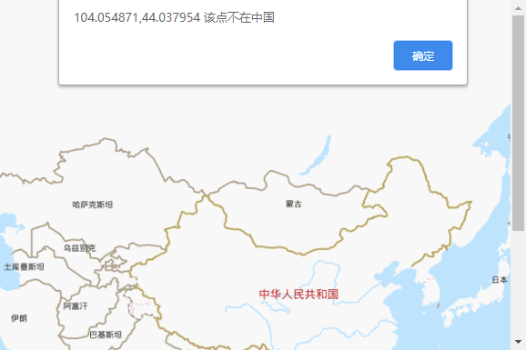

# GISInChina
## 判断坐标点是否在国内(区域内)

>这里规定:
要判断的坐标点叫做给定点
国内或者区域所在的是一组坐标点的集合叫做多边形点

>区域是一多个坐标点的集合,这里通过射线法来判断一个点是否在一个区域内

#### 这个区域的获得方式的几种方法
1.百度地图的鼠标绘制工具来获取区域内的点 ,这个点的集合就是overlays数组中对象的ia属性 . http://lbsyun.baidu.com/jsdemo.htm#f0_7
2.百度地图的行政区获取指定省,多个省来一起判断(精准)  http://lbsyun.baidu.com/jsdemo.htm#c1_10,
3.第三方途径获取

**这里要确定给定点和多边形点是同属于一个坐标系这样才才不会有误差. 如果是google的给定点最好从google获取多边形点**

#### 使用方法,
* 直接执行src中的index.html文件即可,
* ChinaPointList.js 自己通过方法一取得的中国区域点, 不精准
* GISInChina.js判断方法

这里所用到的射线法来自于百度
http://api.map.baidu.com/library/GeoUtils/1.2/examples/simple.html
为了方便这里附该算法,有一点点的修改
